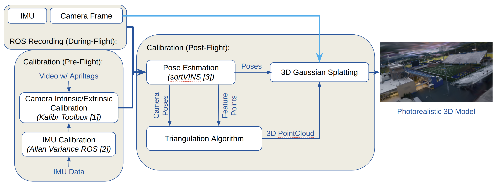

# 3D Scene Reconstruction from UAV-Acquired Imagery

**Authors:** Yuze Du and Andrew Bryceland

## Description

This project is a photorealistic 3D reconstruction pipeline that generates high-quality 3D models from aerial camera data collected during flight. The pipeline integrates camera calibration, pose estimation, and 3D Gaussian Splatting to create detailed 3D point clouds and photorealistic models.



### Pipeline Overview

The reconstruction process consists of two main phases:

**Pre-Flight Calibration:**
- Camera intrinsic and extrinsic calibration using video with AprilTags (Kalibr Toolbox)
- IMU calibration using Allan Variance ROS

**Post-Flight Reconstruction:**
1. **Pose Estimation**: Camera poses are estimated using sqrtVINS
2. **Triangulation**: 3D feature points are triangulated from camera poses and feature points
3. **3D Gaussian Splatting**: Final photorealistic 3D model is generated from poses and 3D point cloud

The system records ROS data during flight from both IMU and Camera Frame sources, enabling accurate post-processing and reconstruction.

## Installation

The installation process is divided into two parts:

### Part 1: 3D Gaussian Splatting

1. **Clone the repository with submodules:**
   ```bash
   git clone --recursive https://github.com/yuzedu/UAV3R_Project.git
   cd UAV3R_Project
   ```

2. **Install Python dependencies:**
   ```bash
   pip install -r requirements.txt
   ```

3. **Install submodules:**
   The project includes the following submodules in the `submodules/` directory:
   - `diff-gaussian-rasterization`: Differentiable Gaussian rasterization
   - `fused-ssim`: Structural similarity implementation
   - `mast3r`: MASt3R feature matching
   - `simple-knn`: K-nearest neighbors implementation

   Install each submodule:
   ```bash
   cd submodules/diff-gaussian-rasterization
   pip install -e .
   cd ../fused-ssim
   pip install -e .
   cd ../simple-knn
   pip install -e .
   cd ../..
   ```

### Part 2: SqrtVINS System

The SqrtVINS visual-inertial navigation system is used for pose estimation. Installation follows the same process as OpenVINS for ROS2:

1. **Install ROS2** (if not already installed)
   - Follow the official [ROS2 installation guide](https://docs.ros.org/en/humble/Installation.html)

2. **Install OpenVINS/SqrtVINS dependencies:**
   ```bash
   sudo apt-get install libeigen3-dev libboost-all-dev libceres-dev
   ```

3. **Build the workspace:**
   ```bash
   cd <your_ros2_workspace>/src
   git clone https://github.com/rpng/sqrtVINS.git
   cd ..
   colcon build
   source install/setup.bash
   ```

For detailed SqrtVINS configuration and usage, refer to the [OpenVINS documentation](https://docs.openvins.com/).

## Usage

### Input Requirements

The pipeline requires a ROS bag containing:
- Camera frames
- IMU data
- Transformation between camera and IMU

If the transformation between camera and IMU is not available, use [Kalibr](https://github.com/ethz-asl/kalibr) for camera-IMU calibration. Kalibr provides accurate intrinsic and extrinsic calibration using calibration targets like AprilTags or checkerboard patterns.

### Processing Steps

1. **Pose Estimation and Feature Extraction**

   After cloning sqrtVINS, copy the configuration and launch files from this repository:
   ```bash
   # Copy config files to sqrtVINS config directory
   cp -r SqrtVINS/config/* <your_ros2_workspace>/src/sqrtVINS/config/

   # Copy launch files to sqrtVINS launch directory
   cp SqrtVINS/launchFile/* <your_ros2_workspace>/src/sqrtVINS/launch/
   ```

   Run sqrtVINS on the ROS bag to perform real-time pose estimation and feature extraction:
   ```bash
   ros2 launch sqrtvins <your_config>.launch
   ```

   The system will:
   - Extract feature points using cv.FAST (Features from Accelerated Segment Test) detector
   - Estimate camera poses in real-time
   - Record both pose trajectories and extracted feature points

   The feature extraction results are saved for use in the subsequent triangulation step.

2. **Extract Images from ROS Bag**

   Extract camera images from the ROS bag for later use:
   ```bash
   # Install required dependencies
   pip install rosbags opencv-python tqdm

   # List available topics in the bag
   python extract_images_from_rosbag.py /path/to/rosbag2 --list-topics

   # Extract images from camera topic
   python extract_images_from_rosbag.py /path/to/rosbag2 /camera/image_raw -o ./output/images

   # Optional: Extract every 5th frame to reduce data
   python extract_images_from_rosbag.py /path/to/rosbag2 /camera/image_raw -o ./output/images -s 5
   ```

3. **Triangulation with Bundle Adjustment**

   Triangulate 3D points from camera poses and feature correspondences:
   ```bash
   python triangulation.py
   ```

   You'll need to modify the script to load your actual data:
   - Camera poses from sqrtVINS output
   - Feature tracks from sqrtVINS feature extraction
   - Camera intrinsic matrix K

   The script performs:
   - Direct Linear Transform (DLT) triangulation
   - Bundle adjustment to refine 3D points (poses fixed)
   - Outputs optimized 3D point cloud

4. **Convert to COLMAP Format**

   Convert the triangulated points and poses to COLMAP format:
   ```bash
   python convert_to_colmap.py --output ./output/sparse/0
   ```

   This creates the COLMAP structure:
   - `cameras.bin`: Camera intrinsic parameters
   - `images.bin`: Camera poses and 2D keypoints
   - `points3D.bin`: Triangulated 3D points

5. **Run 3D Gaussian Splatting**

   Train the 3D Gaussian Splatting model:
   ```bash
   python train.py -s ./output
   ```

   Render the trained model:
   ```bash
   python render.py -m ./output/<model_path>
   ```

6. **Visualize Results**

   You can visualize the trained 3D Gaussian Splatting model using [SuperSplat](https://superspl.at/editor):

   - Locate the generated `.ply` file in your output directory
   - Open [https://superspl.at/editor](https://superspl.at/editor) in your web browser
   - Drag and drop the `.ply` file into the SuperSplat editor
   - Interact with the 3D model in real-time

## Demo Results

Example reconstruction result visualization:


**Full Results:**
- All `.ply` models and additional visualization videos are available at: [Google Drive - Results](https://drive.google.com/drive/folders/1za5_e-UDhSbdU-IUk8arQ6JAeWoARWNo?usp=sharing)
- ROS bag data is available at: [Google Drive - ROS Bags](https://drive.google.com/drive/folders/1nKuOCwT3Nz7Bp_IxtWwc8AJbJZ-3yy4H?usp=sharing)

You can visualize the `.ply` files using [SuperSplat](https://superspl.at/editor).

### Expected Folder Structure

After running the complete pipeline, your output folder should follow this structure:

```
output/
├── images/                    # Extracted images from ROS bag
│   ├── frame_000000.jpg
│   ├── frame_000001.jpg
│   ├── ...
│   └── timestamps.txt
├── sparse/
│   └── 0/                     # COLMAP format data
│       ├── cameras.bin        # Camera intrinsics
│       ├── images.bin         # Camera poses & 2D points
│       └── points3D.bin       # 3D point cloud
└── <model_outputs>/           # 3D Gaussian Splatting results
    ├── point_cloud/
    ├── cameras/
    └── ...
```


## Contributions

**Our Contributions:**
- [triangulation.py](triangulation.py) - DLT triangulation with bundle adjustment
- [convert_to_colmap.py](convert_to_colmap.py) - Conversion script to COLMAP binary format
- [extract_images_from_rosbag.py](extract_images_from_rosbag.py) - ROS2 bag image extraction utility
- [convert_3dgs.py](convert_3dgs.py) - 3D Gaussian Splatting conversion script
- [create_gif.py](create_gif.py) - Visualization GIF generation
- [render.py](render.py) - 3D Gaussian Splatting rendering script
- [metrics.py](metrics.py) - Evaluation metrics computation
- Customized launch file for SqrtVINS ([SqrtVINS/launchFile/](SqrtVINS/launchFile/))
- Calibration of customized drone platform

## Acknowledgements

This project builds upon the following excellent open-source work:

- **3D Gaussian Splatting**: [graphdeco-inria/gaussian-splatting](https://github.com/graphdeco-inria/gaussian-splatting) - Original reference implementation of "3D Gaussian Splatting for Real-Time Radiance Field Rendering"
- **SqrtVINS**: [rpng/sqrtVINS](https://github.com/rpng/sqrtVINS) - Robust and Ultrafast Square-Root Filter-based 3D Motion Tracking by the Robot Perception and Navigation Group (RPNG)
- **Kalibr**: [ethz-asl/kalibr](https://github.com/ethz-asl/kalibr) - The Kalibr visual-inertial calibration toolbox for camera-IMU calibration

We thank the authors for making their code publicly available.

## License

Add license information here.
